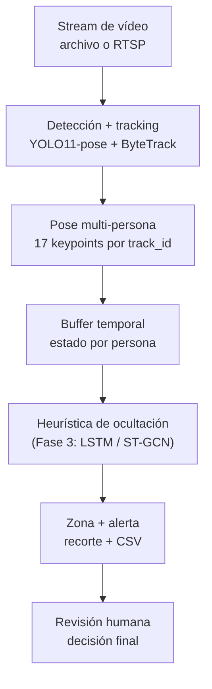

# ShrinkGuard

Detección de **gestos de ocultación** (mano a cinturilla / bolsillo / bolso) en
vídeo, mediante estimación de pose multi-persona con seguimiento. Pensado como
sistema de *prevención de pérdidas* (retail shrinkage) con un principio
irrenunciable: el sistema genera **señales de sospecha para revisión humana**,
nunca decisiones automáticas sobre personas.

> ⚠️ Esto es una **señal**, no una acusación. Toda alerta la valida una persona.
> Antes de cualquier despliegue real, leer la sección de [Ética y legalidad](#ética-y-legalidad).

## Qué hace (Fase 1)

- Lee un vídeo (archivo o webcam).
- Estima pose de todas las personas con `YOLO11-pose` y las sigue con `ByteTrack`
  (un `track_id` estable por persona).
- Aplica una heurística temporal: si la muñeca de alguien permanece N frames
  delante de la cinturilla, dispara una señal.
- Anota el vídeo y guarda un recorte con marca de tiempo en `salidas/revision/`
  más un `eventos.csv`, para que un humano lo revise.

La heurística es deliberadamente sustituible por un clasificador aprendido
(LSTM / ST-GCN) en la Fase 3 sin tocar el resto del pipeline.

## Robustez (Fase 2)

Antes de puntuar, los keypoints pasan por un suavizado temporal que reduce el
ruido del estimador de pose y tolera oclusiones:

- **Media móvil ponderada por confianza** por persona y keypoint → menos *jitter*.
- **Manejo de oclusiones**: si un keypoint deja de ser fiable, se mantiene su
  último valor durante unos frames con la confianza decayendo; si la oclusión se
  prolonga, se da por ausente.
- **Tolerancia a huecos** (`max_gap_frames`): un parpadeo breve sin detección no
  reinicia el contador de frames consecutivos, así una secuencia genuina no se
  rompe por un fallo puntual.

Se desactiva con `--no-smoothing`. Vive en `src/smoothing.py` (solo `numpy`,
testeable sin modelos ni vídeo).

### Zonas de interés (ROI)

Se puede limitar el análisis a un área concreta del frame (p. ej. una zona de
estanterías), ignorando a quien esté fuera. La ROI es un polígono en
coordenadas **normalizadas [0,1]**, así que vale para cualquier resolución:

```bash
# Analizar solo la mitad inferior central del encuadre
python main.py --source 0 --roi 0.1,0.4 0.9,0.4 0.9,0.95 0.1,0.95
```

La ROI se dibuja en ámbar sobre el vídeo. Vive en `src/roi.py` (geometría pura
`numpy`, testeable). En multicámara, `--roi` aplica la misma zona a todas.

### Calibración de umbrales (precision/recall)

Para elegir el umbral con criterio (no a ojo) se mide precision/recall sobre un
pequeño set de clips etiquetados a mano:

```bash
python tools/evaluar.py --videos-dir datos/clips --labels datos/labels.csv \
    --sweep 0.30 0.40 0.45 0.50 0.55 0.60
```

La pose se calcula una vez por vídeo y el barrido de umbral es rápido. La lógica
de métricas vive en `src/evaluation.py` (pura, testeable). Cómo conseguir y
etiquetar los clips (y la nota ética sobre datos personales): ver
[`DATOS.md`](DATOS.md).

## Arquitectura



El acoplamiento con Ultralytics vive solo en `src/pose.py`. El detector
(`src/concealment.py`) trabaja únicamente con `numpy`, por lo que se testea sin
modelos ni vídeo.

```
shrinkguard/
├── main.py                 # CLI
├── src/
│   ├── config.py           # parámetros del pipeline
│   ├── pose.py             # YOLO11-pose + tracking  (única dependencia de Ultralytics)
│   ├── concealment.py      # heurística + estado temporal  (solo numpy, testeable)
│   ├── smoothing.py        # suavizado temporal + oclusiones  (solo numpy, testeable)
│   ├── roi.py              # zonas de interés  (solo numpy, testeable)
│   ├── evaluation.py       # métricas precision/recall  (pura, testeable)
│   ├── visualizer.py       # overlays con OpenCV
│   └── pipeline.py         # bucle principal
└── tests/
    └── test_concealment.py # 6 tests con keypoints sintéticos
```

## Instalación

```bash
python -m venv .venv && source .venv/bin/activate   # Windows: .venv\Scripts\activate
pip install -r requirements.txt
```

La primera ejecución descarga sola el modelo `yolo11n-pose.pt`.

## Uso

```bash
# Vídeo grabado
python main.py --source data/tienda.mp4

# Webcam (Mac con Apple Silicon)
python main.py --source 0 --device mps

# Sin ventana, guardando vídeo anotado (p. ej. en servidor)
python main.py --source data/tienda.mp4 --save salidas/anotado.mp4 --no-window
```

Las evidencias para revisión quedan en `salidas/revision/` (recortes + `eventos.csv`).

## Tests

```bash
python -m pytest -q          # o:  python tests/test_concealment.py
```

## Ética y legalidad

Un sistema que infiere intención de hurto a partir de imágenes de personas es
sensible por diseño. Para un despliegue real en la UE / España hay que tener en
cuenta, como mínimo:

- **RGPD + LOPDGDD**: tratamiento de imágenes de personas. Requiere base legal,
  información (cartelería), minimización y plazos de conservación. Las imágenes
  de la carpeta de revisión son datos personales: cifrado, acceso restringido,
  borrado programado.
- **Guías de la AEPD sobre videovigilancia**: limitan finalidad, ubicación de
  cámaras y conservación.
- **Reglamento de IA (AI Act)**: parte de estos usos pueden considerarse de alto
  riesgo; conviene documentar el sistema, sus límites y su evaluación.
- **Decisión humana obligatoria**: el sistema no acusa, no identifica y no actúa.
  Solo señala para que una persona revise (human-in-the-loop).
- **Falsos positivos**: rascarse, colocarse la ropa o guardar el móvil se parecen
  a "ocultar". Por eso se mide *precision/recall* y se ajustan umbrales; nunca se
  toma la salida como verdad.

> Este repo es un proyecto de aprendizaje/portfolio. No constituye asesoría legal.

## Hoja de ruta

Ver [`GUIA.md`](GUIA.md) para el plan por fases (de la heurística actual al
clasificador temporal, el panel de revisión y el despliegue en tiempo real).

## Licencia

MIT (pendiente de añadir `LICENSE`). Ultralytics YOLO se distribuye bajo AGPL-3.0:
revisa sus términos si piensas usarlo en producción.
